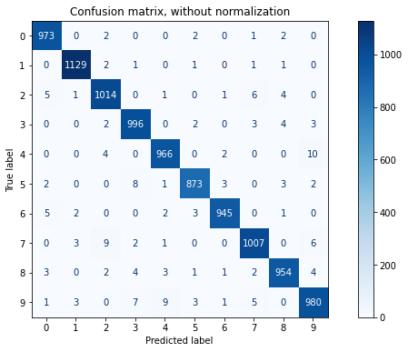
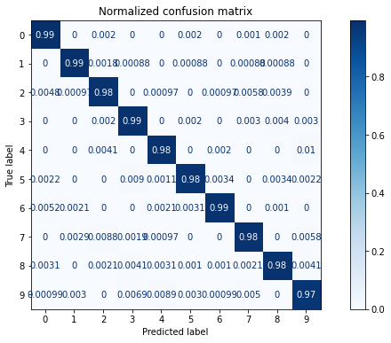

# Results

## Pipeline of `StandardScaler` and `SVC(rbf)`
- Default parameters
- Linear SVM accuracy train: 0.987
- Linear SVM accuracy test: 0.966
- Confusion matrix: (column = predicted, row = actual)
  ```
  968    0    1    1    0    3    3    2    2    0
    0 1127    3    0    0    1    2    0    2    0
    5    1  996    2    2    0    1   15    9    1
    0    0    4  979    1    7    0   12    7    0
    0    0   12    0  944    2    4    7    3   10
    2    0    1   10    2  854    6    8    7    2
    6    2    1    0    4    8  930    2    5    0
    1    6   13    2    3    0    0  990    0   13
    3    0    4    6    6    9    3   14  926    3
    4    6    5   11   12    2    0   20    3  946
  ```

## `SVC(rbf)`
- Default parameters
- Linear SVM accuracy train: 0.9899166666666667
- Linear SVM accuracy test: 0.9792
- Confusion matrix:
  ```   
  973    0    1    0    0    2    1    1    2    0
    0 1126    3    1    0    1    1    1    2    0
    6    1 1006    2    1    0    2    7    6    1
    0    0    2  995    0    2    0    5    5    1
    0    0    5    0  961    0    3    0    2   11
    2    0    0    9    0  871    4    1    4    1
    6    2    0    0    2    3  944    0    1    0
    0    6   11    1    1    0    0  996    2   11
    3    0    2    6    3    2    2    3  950    3
    3    4    1    7   10    2    1    7    4  970
  ```

## `LinearSVC`
- Not converging fast enough with different C (my CPU is not that great)
- The longest run had approx 88% accuracy for both train and test set.

## Grid search of `SVC(rbf)`
- C = [0.001, 0.01, 0.1, 1, 10, 100]
- gamma = [0.001, 0.01, 0.1, 1, 'scale', 'auto']
- For the grid search we decreased the training set size to only 3000 entries
  as it takes a lot of computation with an upper bound of `O(n³)`.
  
  The best parameters were found to be `C = 10` and `gamma = 'scale'`.
- For the real fit we then took the original training set with the above found parameters.
- Linear SVM accuracy train: 0.9999
- Linear SVM accuracy test: 0.9837

This SVC with above parameters is therefore superior to the other trained classifiers.


